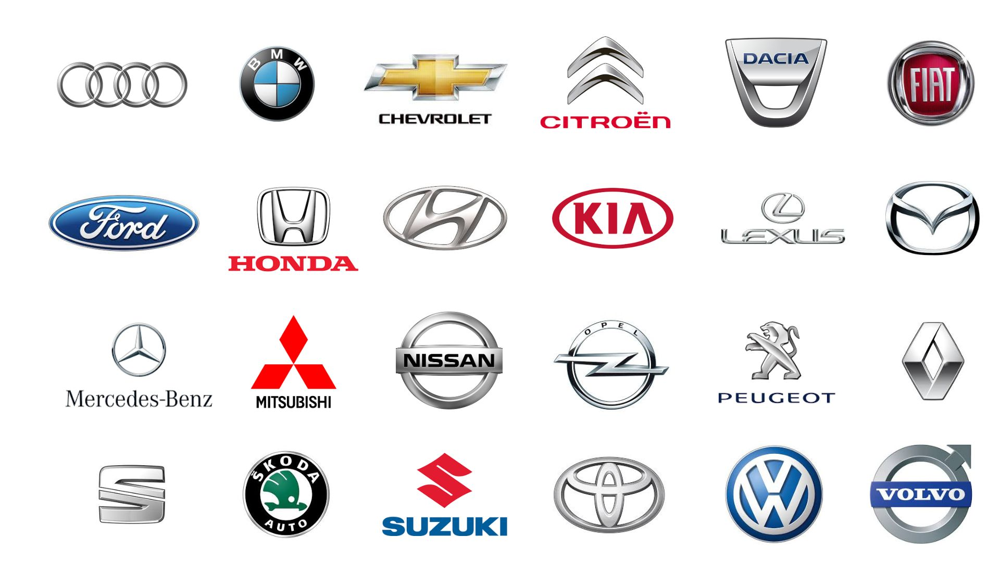

  <h1 id="top" align="center"> 🚘 Vehicle Logo & License Plate Detection</h1>

<h2 id="about-the-project-and-authors"> 👋 About This Project and Authors</h2>
Welcome to our Vehicle Logo and License Plate Detection project!  Our goal is to simplify the task of recognizing vehicle logos and Moroccan license plates using cutting-edge AI technology. If you like the repo, please feel free to give it a ⭐ (top right).  This project is made by :
<li><a href="https://github.com/zayd8890">El-Ouaragli Zayd</a></li>
<li><a href="https://github.com/ou4abs">El-Abbass Ossama</a></li>
<li><a href="https://github.com/MS3B09">Nassiri Mosab</a></li>
<li><a href="https://github.com/HaFares">Hassan Fares</a></li>
<li><a href="https://github.com/Guinga6">Aly Guinga</a></li>

<h2 id="features"> 🌟 Features</h2>
<b>  ●  User-friendly Interface:</b> Our platform provides an intuitive interface for easy navigation and interaction.  
<b>  ●  Advanced Models:</b> We utilize YOLOv8, a state-of-the-art object detection algorithm, to ensure accurate detection results.  
<b>  ●  Flexible Input Options:</b> Input data in various formats, including images, videos, or live webcam streams, to suit your requirements.  
<b>  ●  Extensive Class Recognition:</b> Explore our app to discover the extensive list of classes our models can identify, ranging from popular vehicle logos to Moroccan license plate specific designs.
</a>

<h2 id="technologies-used"> 🛠️ Technologies Used</h2>
<b>  ● Python:</b> We have implemented our project using Python, leveraging its flexibility and rich ecosystem of libraries.  
<b>  ● Streamlit:</b> Our web application is built using Streamlit, a popular Python framework for building interactive web apps.  
<b>  ● YOLOv8:</b> We have chosen YOLOv8 as our object detection model for its state-of-the-art performance and accuracy.  
<b>  ● OpenCV:</b> OpenCV is used for image and video processing tasks, enhancing the capabilities of our platform.

<h2 id="ressources"> 📂 Ressources</h2>
<b>  ● Dataset Used:</b> https://universe.roboflow.com/ms3b/logos-teamx/dataset/1.  

